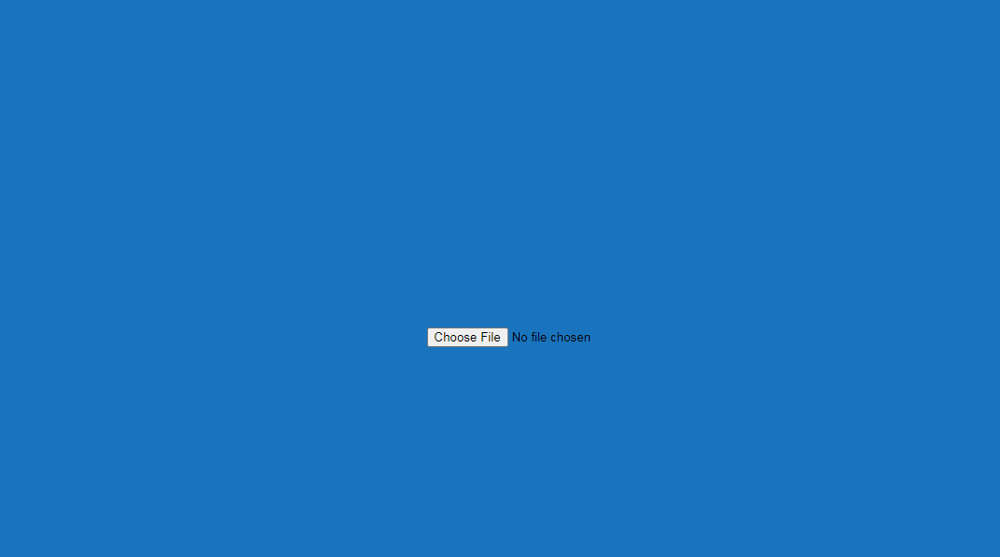
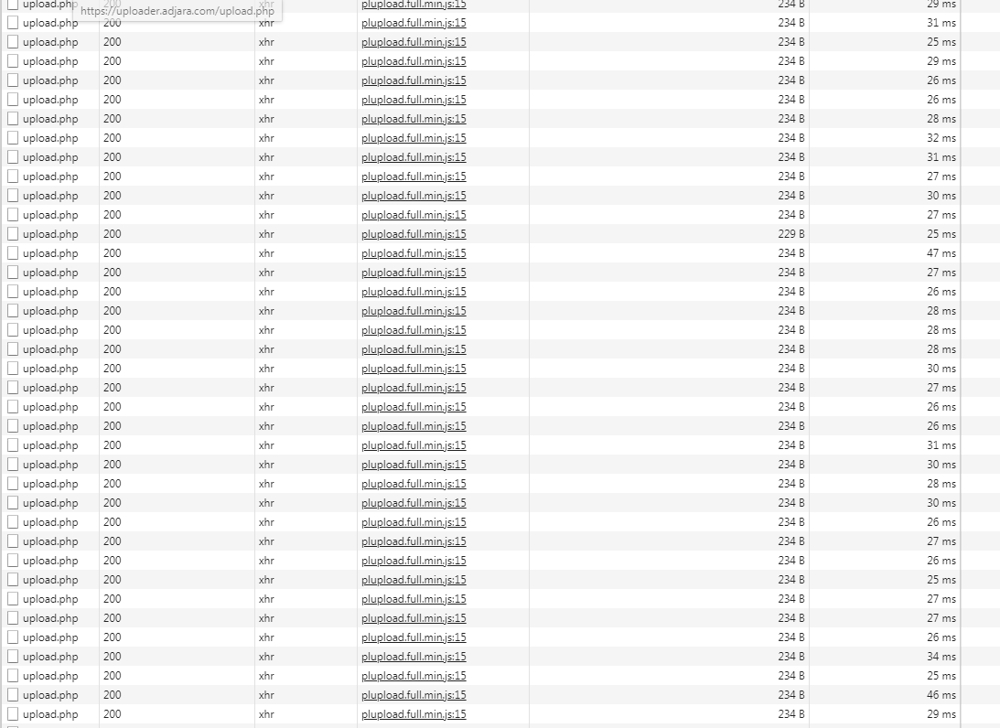

# simple  php web for upload large files to the server by chunks

# instalation:

plupload required:
download latest from: https://www.plupload.com/
mv plupload-*.tar plupload 

# folder structure:

/plupload
/uploads
index.php
upload.php

# NGINX config example:

server {
    root /var/www/html/uploader;
    index  index.php upload.php index.html;
    server_name uploader.example.com;

location / {
        client_max_body_size 20000m;
        client_body_buffer_size 1000m;
        proxy_buffer_size 64k;
        proxy_buffers 2048 64k;
        proxy_max_temp_file_size 0;
        proxy_pass_request_headers on;
        proxy_set_header X-FILE $request_body_file;
        proxy_redirect off;
        proxy_set_body off;
        proxy_http_version 1.1;
        try_files $uri $uri/ /index.php?$args;

}

location ~ \.php$ {
        client_max_body_size 20000m;
        client_body_buffer_size 1000m;
        proxy_buffer_size 64k;
        proxy_buffers 2048 64k;
        proxy_max_temp_file_size 0;
        include snippets/fastcgi-php.conf;
        proxy_pass_request_headers on;
        proxy_set_header X-FILE $request_body_file;
        proxy_redirect off;
        proxy_set_body off;
        proxy_http_version 1.1;
        fastcgi_pass 127.0.0.1:9000;
    }
}

# uploader

# inspect element

